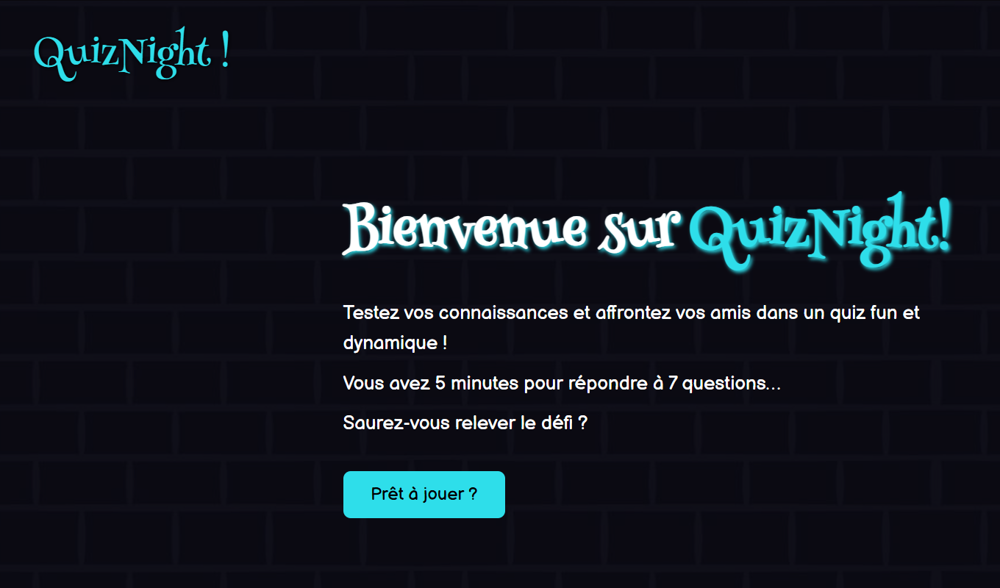

# QuizNight - Quiz Game Website

## Description  
**QuizNight** is an interactive quiz game website designed to help you enhance your knowledge, create your own quizzes, and share them with friends to test their general culture.  

## Demo  


## Installation  

1. **Clone the repository**  
```bash
git clone https://github.com/Hallous-Yassine/QuizNight-App.git
```
2. **Run the backend server**
```bash
cd Backend
npx ts-node src/main.ts
```
3. **Run the frontend**
```bash
cd Frontend/pages
start index.html
```

## Features  
- User authentication: create an account and sign in  
- Personalized profile management  
- Interactive scoreboard showcasing top users  
- Play from a selection of available quizzes  
- Create and share custom quizzes with friends  

## Project Architecture  

### Backend 
```bash
src
├───assets
│ └───quiz-images
├───cmd
├───config
├───handlers
├───middleware
├───models
├───routes
└───services
```

### Frontend
```bash
assets
pages
scripts
styles
```


## Tech Stack  

- **Frontend:** HTML, CSS, JavaScript  
- **Backend:** Node.js, TypeScript  

## License  
This project is licensed under the [MIT License](LICENSE).  


